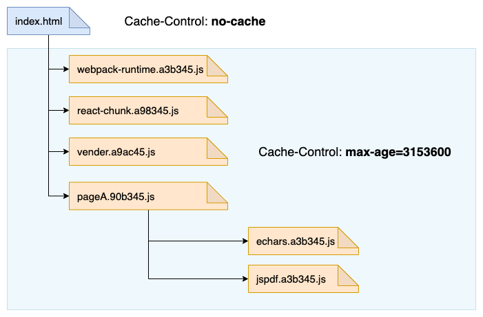

---
categories:
  - 前端工程化
  - JavaScript
tags:
  - 前端
  - JavaScript
---

# 使用 CDN 加速你的网站

前端面试过程中有一个万能的面试题，当他们想不到还有什么面试题要问的时候，就会问这个: 如何优化你们的网站性能。

而其中 CDN 就是其中一条，而在我看来，它是最重要的一条: 配置CDN可以使网站性瞬时得到质的提升，即使静态资源打包体积过大，并且缓存策略很差。

那什么是 CDN 呢？

CDN，全称 Content Delivery Network，内容发布网络。将网站的内容发布到最接近用户的边缘网络，使用户可以以更低的网络时延接收到网站内容，避免网络拥塞状况，提高用户访问网站的响应速度。


## CDN 原理简述

简单来说，CDN 可以理解为 `负载均衡服务器 + 缓存代理服务器`，虽然实际原理以及实现算法会复杂很多。


如上图所示，当我们提及 CDN 时，特别是运维人员或者开发负责人时配置 CDN 时，我们可以把 CDN 划分为三个主体：

+ 用户，即你我他，每一个正在使用该网站的人
+ CDN，可理解为一个缓存节点，在当前节点可以快速响应给用户内容
+ 源站，内容的原始站点，CDN 上缓存未击中后，会回源到源站

那用户请求网站内容的具体步骤是什么？根据上图所示:

1. 用户请求网站内容时，通过 Local DNS 进行域名解析
1. Local DNS 请求 CDN 专用的 DNS 权威服务器 (因此当选择某家 CDN 厂商时，有时需要去域名提供商手动调整域名的 DNS 权威服务器)
1. CDN专用DNS服务器负责负载均衡，为用户选择一个合适的 CDN 节点，作为目标节点
1. CDN专用DNS服务器向用户返回目标节点 IP 地址
1. 用户向目标节点的 IP 发起请求
1. 目标节点 IP 地址如果没有响应内容，则向源站发送请求
1. 目标节点从源站获取到内容，缓存，并返回给用户

另外由于 CDN 上存在多个节点为你提供服务，并且隐藏了源站，因此你的网站安全性大大提高，更好地避免了由于一些恶意攻击而导致源站的服务器集群宕机。

## 如何查看网站是否上了 CDN

如果你的网站静态资源上了 CDN，你的网络内容会被 CDN 的负载均衡系统分发到最接近用户的边缘节点。负载策略的策略可能会涉及到节点的，节点的拥塞成都，节点的运营商是否与用户网络一致，

假设当你在北京访问你的网站时，DNS 会解析你的网络内容到北京的 IP 节点，你在上海访问你的网站时，DNS 会解析到上海的 IP。而且为了解决拥塞，还会对网站内容负载均衡到多个 IP 地址。

那么此时问题就很简单了，如果你想知道某一网站是否上了 CDN，那就直接对域名进行 DNS 解析。

以下对我的博客 `shanyue.tech` 以及知乎的静态资源所在的域名 `static.zhihu.com` 为例，使用 `dig` 命令进行 DNS 解析:

``` bash
$ dig shanyue.tech +short
shanyue.tech.w.kunlungr.com.
183.203.69.14
183.203.69.11
183.203.69.13
183.203.69.15
183.203.69.6
183.203.69.9
183.203.69.12
183.203.69.10

$ dig static.zhihu.com +short
static.zhihu.com.w.alikunlun.com.
183.201.230.244
183.201.230.248
183.201.230.240
183.201.230.242
183.201.230.245
183.201.230.241
183.201.230.246
183.201.230.243
```

从以上命令可以看到知乎以及我的博客都采用了 CDN，并且根据 CNAME 记录可知两者都采用了阿里的 CDN 服务: 对域名 CNAME 到 `*.w.alikunlun.com`。

## 为你的网站配置 CDN

由于国内大部分网站采用阿里的CDN，这里以CDN为例讲解如何配置 CDN。详细配置可以参考

## 如何在网站上更好地利用 CDN

如果你需要更好地利用 CDN 提高网站性能，你不需要了解 CDN 的原理，但你更需要更好地了解 HTTP Cache。了解了 http 缓存的运作后，才能更好地充分利用缓存来降低网站的时延。

以下是 CDN 的缓存配置策略:


我们从图中可以获知：

1. 源站和CDN(缓存服务器)均可以配置缓存策略
1. 如果CDN没有配置缓存策略，则以源站缓存策略为主

而就我在多个项目的实践经验而言，很少为 CDN 专门配置缓存策略，因此如果想要更好地利用 CDN，则需要

**为你的源站配置一个不错的缓存策略**

## 更好的缓存策略




此时我们可以对资源进行分层次缓存的打包方案，这是一个建议方案：

1. `webpack-runtime`: 应用中的 `webpack` 的版本比较稳定，分离出来，保证长久的永久缓存
1. `react/react-dom`: `react` 的版本更新频次也较低
1. `vendor`: 常用的第三方模块打包在一起，如 `lodash`，`classnames` 基本上每个页面都会引用到，但是它们的更新频率会更高一些。另外对低频次使用的第三方模块不要打进来
1. `pageA`: A 页面，当 A 页面的组件发生变更后，它的缓存将会失效
1. `pageB`: B 页面
1. `echarts`: 不常用且过大的第三方模块单独打包
1. `mathjax`: 不常用且过大的第三方模块单独打包
1. `jspdf`: 不常用且过大的第三方模块单独打包

随着 `http2` 的发展，特别是多路复用，初始页面的静态资源不受资源数量的影响。**因此为了更好的缓存效果以及按需加载，也有很多方案建议把所有的第三方模块进行单模块打包。**
